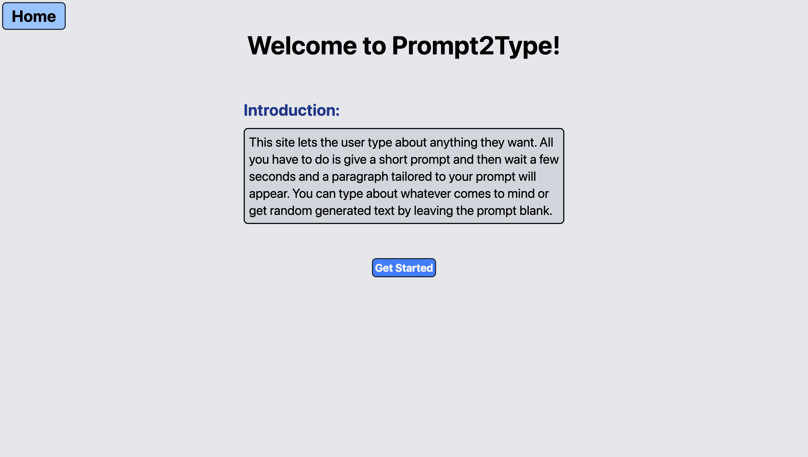
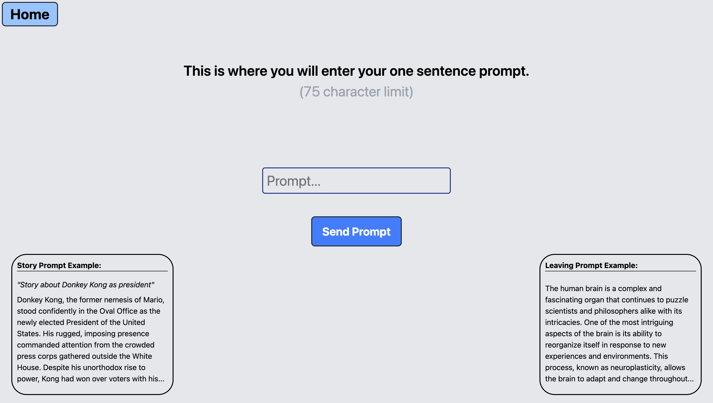
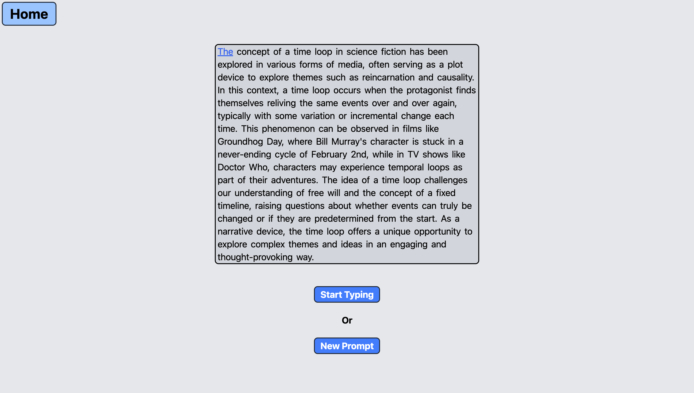
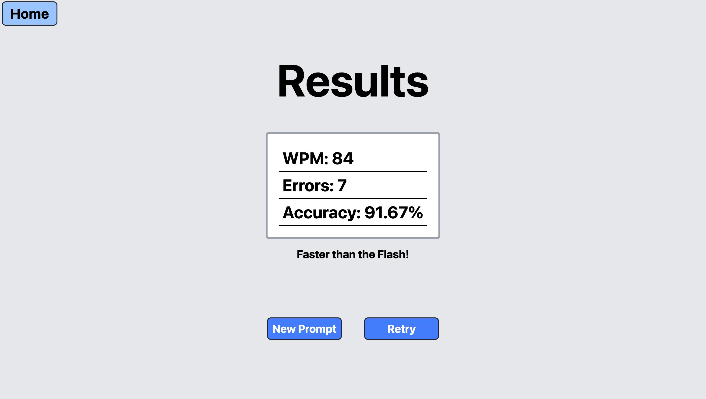

# Local LLM Typing Test

A typing speed test powered by locally generated AI text using an LLM and React

## Demonstration

### Sending Prompt


### Starting Typing


### Finishing Typing


## Introduction

This project is a typing speed test application that generates completely unique typing paragraphs using a local LLM. Instead of using static or repeated text samples, the test creates a fresh paragraph every time based on a prompt you provide. I built this to experiment with UI design and learn how to integrate a local AI model with a React frontend.

## Features

- Generates unique text using a local LLM (Llama 3.2)
- Real-time typing test with WPM, accuracy, and error tracking
- Results page with stats and feedback
- Clean UI built with TailwindCSS
- Uses a local REST interface.
- Prompt-based text generation

## Tech Stack

**Frontend:**

- React (Vite)
- React Router
- TailwindCSS

**Backend / AI:**

- Ollama (local LLM runtime)
- Llama 3.2 model

**Other Tools:**

- Git / GitHub
- macOS Screen Recording

## How It Works

1. The user enters a short prompt.
2. The prompt is sent to a local LLM via Ollama.
3. The LLM generates a paragraph (150–200 words).
4. The text is sent to the typing test page using React Router state.
5. The user types the paragraph while WPM, errors, and accuracy are tracked.
6. Once the timer ends, the results page shows:

- Words Typed
- Errors
- Accuracy %
- Message based on performance

## Screenshots

### Home Page



### Prompt Page



### Typing Test



### Results Page



## Installation

### 1. Clone the Repository

```
git clone https://github.com/haydenshubert/AI-Typing-Site.git
```

### 2. Enter Working Cirectory and Install Packages

```
cd ai-typing-site

npm install

brew install ollama

ollama run llama3.2

npm run dev
```

## Usage

1. Navigate to the prompt page.
2. Enter a prompt describing the type of text you want generated.
3. Click **Send Prompt**.
4. When text is ready, click **Start Typing** and begin typing.
5. When timer is up, click **See Results**
6. View your stats on the results page.

## Future Improvements

- Add custom timer lengths
- Add multiple themes (dark mode)
- Add premade prompts/saved prompts
- Save user stats locally
